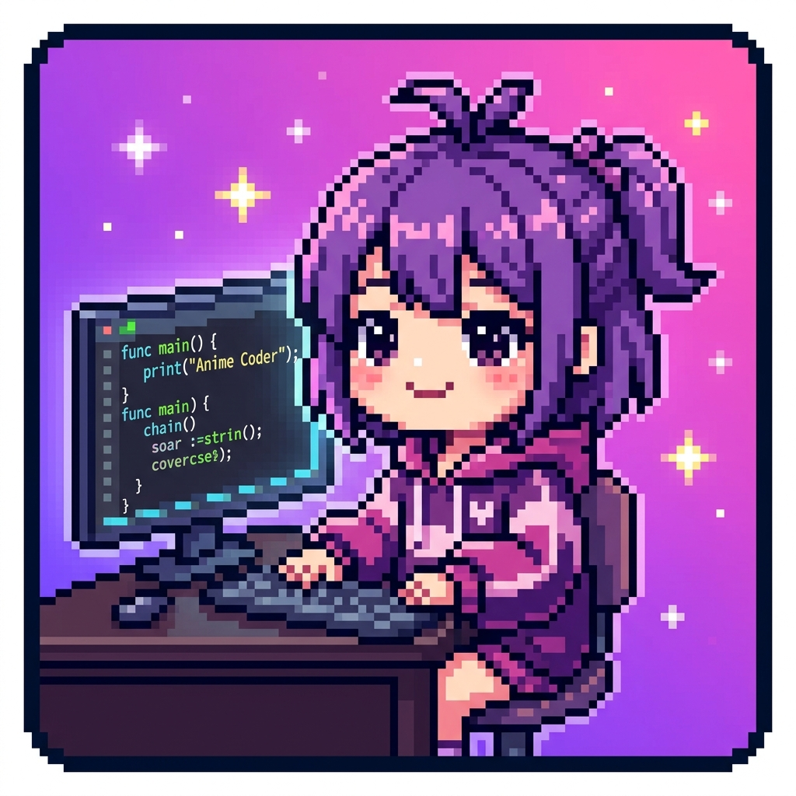

# Anime Coder 🌸

Bring your favorite anime characters to life right inside your VS Code editor! **Anime Coder** spawns cute, animated pixel-art characters that walk, run, and hang out at the bottom of your screen while you code.

Inspired by the fun of `vscode-pokemon` and the aesthetic of `doki-theme-vscode`.

## ✨ Features

- **Animated Characters:** Watch characters like Naruto, Goku, and Luffy run across your editor.
- **Multiple Series:** Characters from *Naruto*, *Dragon Ball*, *One Piece*, *Sailor Moon*, *Attack on Titan*, *Studio Ghibli*, and more!
- **Interactive Playground:** Characters have their own state machine—they walk, run, sit, and idle randomly.
- **Flexible Positioning:** Choose between a dedicated **Bottom Panel** or the **Explorer Sidebar**.
- **Customization:** Change character sizes (Nano to Large) and set background themes.
- **Persistence:** Your squad of characters is saved and will return whenever you reopen VS Code.

## 🚀 Getting Started

### Installation

1. Open **VS Code**.
2. Go to the Extensions view (`Ctrl+Shift+X`).
3. Search for **Anime Coder** and click **Install**.
   *(Or if installing manually, use the "Install from VSIX" option).*

### How to Use

1. **Start the Session:** 
   Press `Ctrl+Shift+P` and type `Anime Coder: Start Session`. This opens the playground.
2. **Spawn a Character:** 
   Press `Alt+Shift+A` (or use the command `Spawn Anime Character`). You can search by name or browse by anime series.
3. **Random Spawn:** 
   Feeling lucky? Press `Alt+Shift+R` to spawn a random character.
4. **Remove Characters:** 
   Press `Alt+Shift+D` to select a character to remove, or `Alt+Shift+Backspace` to clear them all.
5. **Roll-Call:** 
   Run `Anime Coder: Roll-call` to see the names of all your active companions.

## ⚙️ Configuration

You can customize your experience in `Settings > Extensions > Anime Coder`:

- **Character Size:** `nano`, `small`, `medium`, or `large`.
- **Position:** `panel` (bottom) or `explorer` (sidebar).
- **Theme:** Choose a background like `konoha`, `capsulecorp`, or `grandline`.
- **Default Characters:** Set a list of characters to automatically spawn every time you start VS Code.

## 🎭 Character Roster

| Character | Series |
| :--- | :--- |
| **Naruto Uzumaki** | Naruto |
| **Son Goku** | Dragon Ball |
| **Monkey D. Luffy** | One Piece |
| **Sailor Moon** | Sailor Moon |
| **Levi Ackerman** | Attack on Titan |
| **Totoro** | Studio Ghibli |
| **Tanjiro Kamado** | Demon Slayer |
| **Gojo Satoru** | Jujutsu Kaisen |
| **Izuku Midoriya** | My Hero Academia |
| **Tohru** | Dragon Maid |
| **Eren Yeager** | Attack on Titan |

## 🛠️ Commands & Shortcuts

| Command | Shortcut |
| :--- | :--- |
| `Spawn Anime Character` | `Alt+Shift+A` |
| `Spawn Random Anime Character` | `Alt+Shift+R` |
| `Remove Anime Character` | `Alt+Shift+D` |
| `Remove All Anime Characters` | `Alt+Shift+Backspace` |

## 🤝 Credits

- Based on the architecture of [vscode-pokemon](https://github.com/jakobhoeg/vscode-pokemon).
- Inspired by the themes of [doki-theme-vscode](https://github.com/doki-theme/doki-theme-vscode).
- Sprite art generated with AI for the initial release.

---
**Enjoying Anime Coder?** Leave a ⭐ on the [GitHub repository](https://github.com/vikas0304/vscode-anime)!
